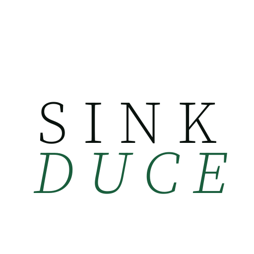

<div align="center">


# SINKDUCE

$$\text{\textbf{Spark. Sink. Educe.}}$$

*An intelligent, context-isolated personal memory system — one-click deployable RAG agent with MCP server.*

[](LICENSE)
[](https://www.python.org/)
[](https://react.dev/)
[](https://www.docker.com/)
[](https://modelcontextprotocol.io/)

[Quick Start](#-quick-start) • [How It Works](#-how-it-works) • [Features](#-features) • [MCP Server](#-mcp-server) • [Architecture](#-architecture)

</div>

---

SinkDuce is a **high-fidelity cognitive filter** — not a document dump. It turns meetings, lectures, notes, and files into structured, context-isolated knowledge that you can query, distill, and federate across project boundaries. Every answer traces back to its source through three layers of provenance.

---

## 🚀 Quick Start

**Prerequisites**: [Docker](https://docs.docker.com/get-docker/)

```bash
git clone https://github.com/superdd-coder/sinkduce.git
cd sinkduce
docker compose up -d --build
```

Open [http://localhost:18900](http://localhost:18900). On first launch:

1. Download local transcription models if you need offline STT (FunASR SenseVoiceSmall).
2. Go to **Settings** → add an **LLM provider** (any OpenAI-compatible API works).
3. Add an **Embedding provider** and create your first Collection.

> [!TIP]
> **DashScope OneShot** — Settings → LLM Providers → OneShot Setting (DashScope API). Enter your Alibaba Cloud API key. Pre-configures LLM (`deepseek-v4-flash`), Embedding (`text-embedding-v4`, 1024d), Reranker (`qwen3-rerank`), and both Transcription providers (`fun-asr`, `fun-asr-realtime`).

> [!TIP]
> **OpenRouter OneShot** — Settings → LLM Providers → OneShot Setting (OpenRouter API). Enter your key; models are auto-fetched and classified into LLM, Chat (function-calling filtered), Vision, Embedding, and Reranker categories.

> [!TIP]
> **MinerU Cloud Parsing (optional)** — For high-quality PDF extraction with table/formula/layout preservation:
> 1. Get a free API token at [mineru.net/apiManage/token](https://mineru.net/apiManage/token).
> 2. Go to **Settings** → scroll to **MinerU CLOUD PARSING** → toggle **ENABLE** → paste your token.
> 3. In each **Collection → Config**, enable **Cloud Parsing (MinerU)** to activate it for that collection.
>
> When enabled, uploaded PDFs/DOCXs/PPTXs/images are parsed by MinerU's cloud API with automatic fallback to local parsers on failure.

### Updating

```bash
git pull && docker compose up -d --build
```

Your `data/` directory (Qdrant database, config, history, meetings, notes, hot words) is preserved across rebuilds via the Docker volume mount.

---

## 💡 How It Works

SinkDuce is built around three verbs:

### Spark — Capture

SinkDuce provides two independent capture entry points: **Meetings** for spoken audio, and **Notes** for written thought and structured authoring.

#### Meetings

Record a meeting (capturing both mic and system audio) or upload an audio file. The **FunASR SenseVoiceSmall** model transcribes it locally for offline use. For higher accuracy, plug in DashScope or OpenAI-compatible cloud transcription models — the DashScope integration has been specifically optimized, and the recommended path is **OneShot Setting (DashScope API)** which configures LLM + Embedding + Reranker + Transcription in one step. Real-time **WebSocket streaming** shows live captions as you speak, automatically distinguishing partial from final results. Speaker diarization, VAD, and punctuation restoration further improve transcription quality.

After transcription, a **two-pass LLM pipeline** fires:

1. **General Summary + Blueprint Auto-Sectioning**: Pass 1 generates a streaming General Summary via SSE; simultaneously, a second call produces the Blueprint — the system feeds the user's existing **Collection catalog (names, definitions, coverage scopes)** to the LLM as a classification taxonomy. The LLM automatically identifies distinct topics in the meeting and decomposes them into semantically independent sections. Existing Collections are matched directly; when the meeting covers a topic that doesn't yet have a Collection, **the LLM inherits the user's classification logic, identifies new independent topics at the same dimension, and suggests creating corresponding new Collections**, maintaining consistency across the entire knowledge base taxonomy.
2. **Per-Section Deep Summaries**: for each auto-detected section, the LLM pinpoints relevant sentences from the transcript and generates focused Markdown (SSE-streamed).

Every sentence in the summary is clickable — jump to its source transcript timestamp and sync audio playback. Sections can be **allocated to Collections** with one click — content is automatically chunked, embedded, and indexed as searchable documents. You can also manually add custom sections, edit section descriptions, and regenerate individual section summaries. All summaries are editable Markdown — edits persist across subsequent operations.

The meeting management UI provides: meeting list, editable title, audio playback control bar (live captions toggle, hot words library selector, multi-language hint selector), and tabbed viewing of Summary / Notes / Transcript / Speaker info. The transcript panel supports full-text search, speaker name editing, and section tag navigation.

#### Notes (Collection Notes)

Create structured notes within each Collection using a full **Tiptap WYSIWYG editor** — supports Markdown syntax, headings, tables, task lists, code blocks, image paste/drag-drop, and YouTube embeds. Notes auto-save.

The core capabilities are **Distill** and **Propagate**:

- **Distill**: **drag** any note from the left sidebar onto the current editor — the LLM condenses the source note's essence into a citation block at the drop position. Results are automatically cached — the LLM is not called again if the source hasn't changed.
- **Propagate**: when a referenced source note changes, clicking "Propagate Changes" re-distills the source into all downstream notes and **recursively chain-propagates** — if downstream notes are themselves referenced by other notes, those are updated too. Preview the full update chain before confirming.
- **Bidirectional Reference Graph**: the system automatically maintains reference relationships between notes. The right sidebar shows Distill In (sources I reference) and Distill Out (notes that reference me) navigation.

Notes can also be **ingested** into the Collection with one click — content is automatically chunked, embedded, and indexed as a searchable document. Ingestion can be removed at any time. Import from .md/.txt, export as .md.

### Sink — Organize

Everything lands in a **Collection** — an isolated Qdrant vector database. Each project, course, or domain gets its own Collection. Zero cross-contamination.

Upload documents in any of **12 formats**: PDF (with OCR for scanned pages), DOCX, PPTX, XLSX, Markdown, HTML, CSV, JSON/JSONL, plain text, and images (OCR). An optional **MinerU cloud parser** provides higher-quality PDF/DOCX/PPTX/image extraction with layout preservation, formula recognition, and table structure detection.

Each document is parsed, then chunked. The system splits intelligently at sentence boundaries (CJK-aware), merging paragraphs to a configurable token budget. Markdown chunking preserves heading hierarchy. Oversized tables are split by row with the header repeated on each sub-table; image blocks and distill blocks are never split. Both modes support **Parent-Child mode**: parents carry full context; retrieval matches smaller, more precise children but returns the full parent text.

If **Contextual Retrieval** is enabled, the LLM enriches each chunk with a situating context paragraph that fills in global context missing from the isolated chunk. Large documents support async batch processing.

After chunking, the LLM auto-generates a structured document summary (Key Data / Facts / Insights).

When a document is added to or removed from "definitive" status, **Consolidation** fires automatically: the LLM reads all summaries from documents marked "definitive", generates a collection-level overview, a project description, and a conflict report flagging contradictions between sources.

A **Collection Catalog** — per-collection definition, coverage scope, and tags — is maintained automatically and used by the agent to route queries.

### Educe — Reason

Ask a question. The system retrieves, grades, and synthesizes.

**Session-based chat** streams responses via SSE, with the agent's thinking process and tool calls rendered as an interleaved **timeline** — reasoning text and search steps alternate, fully observable. Users toggle a **Think** button for extended reasoning mode.

Two search modes, chosen by the LLM agent based on query complexity:

- **Direct**: single-pass hybrid retrieval. The query is embedded as both dense and BM25 sparse vectors (LLM extracts keywords and expands synonyms), fused via Reciprocal Rank Fusion in Qdrant. An optional reranker re-scores candidates to ensure the most relevant content ranks first.
- **Agentic**: full multi-step reasoning pipeline. The LLM decomposes complex questions into atomic sub-queries, routing each to the most relevant Collections using catalog metadata (definitions, tags, coverage). For each sub-query, multiple semantic variants are generated and retrieved in parallel, deduplicated, then the LLM judges relevance and gap analysis in a single call. Finally, all task contexts are aggregated and synthesized into the answer.

Every answer comes with **3-layer source traceability**: click any source to drill from text snippet → full document context → original file preview, verifying claims layer by layer.

A built-in **Recall Evaluation** suite auto-generates test cases, with the LLM as judge scoring each result with reasoning and providing a holistic "can_answer" judgment. Metrics include recall, MRR, and quality score.

SinkDuce also ships with a built-in **MCP server** (43 atomic tools), so your curated memory doesn't stay locked in the Web UI. Connect Claude Code, Cursor, or any MCP-compatible client — your AI coding assistant can directly search your knowledge bases, manage documents, and operate on meetings and notes. **Your memory flows into every tool you already use.**

---

## ✨ Features

### Meetings

| Feature | Description |
|---------|-------------|
| **Audio Transcription** | File upload or WebSocket realtime streaming. FunASR runs locally offline; DashScope and OpenAI-compatible cloud models available for higher accuracy. Speaker diarization, VAD, and punctuation restoration supported. |
| **Live Captions** | Real-time transcription pushed during recording, auto-distinguishing partial vs final text. Transcript scrolls in sync with audio playback. |
| **Blueprint Auto-Sectioning** | LLM auto-detects topics using your existing Collection catalog as a classification taxonomy, decomposing the meeting into sections naturally aligned with your Collections. Custom sections can be added and regenerated. |
| **Per-Section Deep Summaries** | Each section gets a focused Markdown summary (SSE-streamed), with the LLM pinpointing relevant sentences from the transcript. |
| **Editable Summaries** | All summaries are editable Markdown — General Summary, section summaries, and meeting notes saved independently. Edits persist across subsequent operations. |
| **Meeting Notes** | Each meeting has its own Markdown note page for recording thoughts during the meeting, existing alongside auto-generated summaries. Import from .md/.docx/.txt supported. |
| **Sentence-Level Provenance** | Every sentence in the summary clicks through to the source transcript timestamp with synced audio playback. Each sentence is automatically tagged with its topic section, showing how each subject thread runs through the meeting. |
| **Speaker Management** | Edit speaker names inline in the transcript panel. Speaker tab shows per-speaker info cards with sampled segments. |
| **Hot Words & Language Hints** | Attach hot words libraries (weighted terms + language codes) and multi-language hints to boost domain-specific ASR accuracy. |

### Notes (Collection Notes)

| Feature | Description |
|---------|-------------|
| **Tiptap Editor** | Full WYSIWYG editing with Markdown, headings, tables, task lists, code blocks, image paste/drag-drop, and YouTube embeds. Auto-save. |
| **Distill** | Drag a note onto the editor — LLM condenses the source note's core insights into a citation block. Results auto-cached — LLM not called again if source unchanged. |
| **Propagate** | After editing a source note, re-distill into all downstream notes → recursively chain-propagate. Preview the full update chain before confirming. |
| **Bidirectional Reference Graph** | Auto-maintained reference relationships between notes. Right sidebar shows Distill In/Out navigation. |
| **Ingest & Export** | One-click ingest: note content auto-chunked, embedded, indexed as searchable document. Images are automatically OCR'd and visually described during ingest — no manual processing needed. Removable anytime. Import/export as .md/.txt. |

### Ingestion & Organization

| Feature | Description |
|---------|-------------|
| **12 Format Parsers** | PDF (with OCR for scanned pages), DOCX, PPTX, XLSX, Markdown, HTML, CSV, JSON/JSONL, plain text, images (OCR). Connect to **MinerU** for more powerful document parsing capabilities. |
| **Context-Isolated Collections** | Independent Qdrant vector databases. Configurable: chunk mode, parent strategy, chunk sizes, embedding dimensions, search mode, file type allowlist, contextual enrichment, agent, MinerU cloud parsing toggles. |
| **Parent-Child Chunking** | Parents carry full context; retrieval matches smaller, more precise children but returns parent text. Three strategies: paragraph-based, heading-based, or fixed-token. |
| **Contextual Retrieval** | LLM enriches each chunk with situating context to fill in missing global information. Large documents support async batch processing. |
| **Auto-Summarization & Consolidation** | Structured per-document summaries via LLM. Collection-level consolidation with conflict detection (flags contradictions between sources). Toggle documents "definitive" to include/exclude. |
| **Collection Catalog** | Auto-maintained per-collection: definition, coverage scope, tags. Powers agent's semantic query routing. |
| **Semantic Meeting Router** | Multi-topic meetings split automatically: each section allocated to its most relevant Collection. |

### Retrieval & Reasoning

| Feature | Description |
|---------|-------------|
| **Hybrid Search** | Dense vector + BM25 sparse (LLM extracts keywords and expands synonyms). Reciprocal Rank Fusion via Qdrant. Sparse vocabulary auto-rebuilds at a threshold after document changes to keep term weights accurate. |
| **Multi-Provider Reranking** | Cohere, DashScope/Qwen, OpenAI-compatible. Pluggable architecture — switch backends as needed. |
| **Agentic RAG** | Decompose → parallel variant generation → retrieve → combined grade (relevance + gap analysis, one LLM call) → aggregate → synthesize. Fully observable pipeline. |
| **Multi-Collection Federated Search** | Query across multiple Collections. Catalog metadata routes sub-queries to the most relevant Collections. |
| **3-Layer Source Traceability** | Answer → text snippet → full document → original file preview. Verify claims layer by layer. |
| **Session-Based Chat** | Persistent multi-turn conversations. LLM agent selects search strategy autonomously. Timeline shows interleaved thinking + tool calls. Think toggle for deep reasoning. Auto-titled sessions. |
| **Per-Collection Quick Chat** | Floating slide-out panel with SSE streaming, thinking display, and source navigation. Ideal for rapid lightweight Q&A. |
| **Recall Evaluation** | Auto-generated test cases, LLM-as-judge scoring with reasoning. Metrics include recall, MRR, and quality score. Evaluation history browser. |

### Extensibility

| Feature | Description |
|---------|-------------|
| **MCP Server** | 43 atomic tools across 8 domains. HTTP Streamable transport. Shared FastAPI process — no separate server needed. |
| **Pluggable Providers** | Unified adapter pattern for LLM, Embedding, Reranker, File Transcription, Realtime Transcription. Add new backends by implementing the interface and registering. |
| **OneShot Setup** | DashScope and OpenRouter pre-configuration paths. Auto-fetches available models, classifies by type, creates providers, sets defaults. |
| **Local-First, Cloud-Ready** | FunASR and Tesseract run locally. All providers can target Ollama/LM Studio/vLLM for fully air-gapped operation. |
| **Async Task System** | Dual-queue architecture: upload queue + general pool with parallel processing. Cancellable and retryable tasks, live progress via SSE log stream. |

---

## 🔌 MCP Server

SinkDuce exposes **43 atomic MCP tools** over HTTP (Streamable HTTP transport) on the same FastAPI process as the REST API. The MCP server reuses the app's services, task manager, and database connections — no separate process is spawned.

### Setup

Add to `.mcp.json` at your project root (or `~/.claude/.mcp.json` for global access):

```json
{
  "mcpServers": {
    "sinkduce": {
      "type": "http",
      "url": "http://localhost:18900/mcp"
    }
  }
}
```

Start the backend first (`docker compose up -d`). The MCP client connects to the running server.

### Tool Domains

| Domain | Count | Key Capabilities |
|--------|-------|-----------------|
| **Collections** | 5 | List all, get metadata+config, create (26 configurable parameters), update config (rejects destructive fields: `chunk_mode`, `embedding_*`), delete (refuses if last remaining) |
| **Documents** | 6 | List with metadata, upload via staging token or server-local path, delete (cleans chunks + summaries + triggers sparse recalc), chunk inspection (paginated, parent/child filterable), full-text extraction (windowed), toggle definitive flag |
| **Search** | 3 | Direct retrieval (dense/sparse/hybrid, optional reranking, multi-collection), Agentic RAG (full pipeline, auto-discovers collections via catalog), query history (with optional detail expansion) |
| **Tasks** | 5 | List (filterable by collection, status, type), get status with progress/error, cancel (cooperative), retry (re-enqueues failed), clear completed |
| **Summaries** | 4 | Collection overview, per-document structured summary (Data/Facts/Insights), conflict list, trigger consolidation (async task) |
| **Notes** | 6 | List (with extracted/ingested flags), get (metadata + content + references), create (auto-timestamped title), update (title/content, auto-syncs injection blocks), delete (cleans chunks + backlinks), trigger propagation (synchronous re-distill with chain propagation) |
| **Meetings** | 9 | List (filterable by status/search), get (metadata + tabs + has_transcript/has_summary/has_notes flags), get section Markdown (`tab_id="general"` for summary), paginated transcript (prefers `sentences.json` with diarization), create, update (speaker names dict, hot words library, notes content), delete (cleans allocated chunks), start summary (async task), upload audio via staging |
| **Hot Words** | 5 | List libraries, get (with weighted words + language codes), create, update (full word list replacement), delete |

---

## 🏗️ Architecture

```
┌──────────────────────────────────────────────────────────┐
│                   Browser (React 19)                       │
│  Chat │ Collections │ Notes │ Meetings │ Settings │ Recall │
└──────────────────────┬───────────────────────────────────┘
                       │ REST + SSE + WebSocket
┌──────────────────────▼───────────────────────────────────┐
│               FastAPI (Python 3.11)                        │
│                                                           │
│  ┌──────────┐  ┌──────────┐  ┌──────────┐  ┌──────────┐ │
│  │ /api/*   │  │  /mcp    │  │  /ws     │  │ /health  │ │
│  │ REST API │  │ MCP HTTP │  │ Realtime │  │          │ │
│  └────┬─────┘  └────┬─────┘  └────┬─────┘  └──────────┘ │
│       │             │             │                       │
│  ┌────▼─────────────▼─────────────▼───────────────────┐  │
│  │              Services Singleton                      │  │
│  │  Config → Qdrant → Embedding → LLM → Retriever     │  │
│  │    → Reranker → DirectQuery → VariantFetcher       │  │
│  │    → Decomposer → Aggregator → AgenticQuery        │  │
│  │    → ContextualRetrieval → Chunker → SessionStore  │  │
│  └──────────────────────┬──────────────────────────────┘  │
│                         │                                 │
│  ┌──────────────────────▼──────────────────────────────┐  │
│  │  Providers (Registry + ABC + Factory)                │  │
│  │  LLM │ Embedding │ Reranker │ Transcription         │  │
│  │  OpenAI-compat · Cohere · DashScope · FunASR local  │  │
│  └─────────────────────────────────────────────────────┘  │
│                                                           │
│  ┌─────────────────────────────────────────────────────┐  │
│  │  Domain Modules                                      │  │
│  │  meeting/ · notes/ · hot_words/ · collections/      │  │
│  │  tasks/ (dual-queue: upload serial + general pool)   │  │
│  └─────────────────────────────────────────────────────┘  │
└──────────────────────┬──────────────────────────────────┘
                       │
┌──────────────────────▼──────────────────────────────────┐
│              Qdrant (Vector Database)                     │
│  Collection A │ Collection B │ ... │ __summaries__       │
└─────────────────────────────────────────────────────────┘
```

### Directory Layout

```
frontend/            React 19 + Vite 6 + Tailwind CSS 4 + Zustand + Tiptap + Recharts
src/
  main.py            FastAPI entry: lifespan, middleware, route mounting, SPA catch-all
  config.py           Pydantic AppConfig → data/config.yaml (with backward-compat migration)
  services.py         Global Services singleton: init_services() / reload_services()
  prompts.py          Centralized prompt registry — all LLM prompts in one file
  api/
    schemas.py        Shared Pydantic request/response models (QueryRequest, SourceItem, etc.)
    routes/           REST endpoints: sessions, query, documents, collections, config,
                      recall, logs, info, visual, meetings, notes, hot_words
  rag/
    agent.py          AgenticQueryService: decompose → parallel fan-out → grade → synthesize
    variant_fetcher.py Parallel variant generation + single-round combined grading
    decomposer.py     Query decomposition using Collection Catalog metadata
    aggregator.py     Context assembly with <sub_query> wrappers + LLM synthesis
    retriever.py      Dense / Hybrid (RRF) / Sparse retrieval
    reranker.py       Multi-provider reranking orchestration
    chunker.py        ParagraphChunker (sentence-boundary-aware, CJK punctuation)
    markdown_chunker.py Markdown-aware: heading breadcrumbs, atomic code blocks/tables
    contextual.py     Contextual Retrieval with batch API + parallel fallback
    summary_manager.py Document/collection summaries, conflicts, project descriptions
  parsers/            12 format parsers: PDF, DOCX, PPTX, XLSX, MD, HTML, CSV,
                      JSON/JSONL, TXT, images (OCR), MinerU cloud
  providers/          LLM, Embedding, Reranker adapters (Registry + ABC pattern)
    embedding/        OpenAI-compatible (supports Matryoshka/truncation)
    llm/              OpenAI-compatible (streaming, vision, batch API)
    reranker/         Cohere, DashScope/Qwen, OpenAI-compatible (native /rerank + logprobs fallback)
  meeting/            Meeting module: transcription, blueprint, section extraction
    transcription/    File + Realtime providers (FunASR local, DashScope, OpenAI-compat)
  notes/              Collection Notes: distill, propagate, injection block parsing
  hot_words/          Weighted vocabulary libraries for ASR
  tasks/              Dual-queue async task manager with cooperative cancellation
  mcp/                MCP server: 43 tools across 8 domains, HTTP Streamable transport
  models/             HuggingFace/ModelScope model download manager
data/                 Runtime data (all gitignored): qdrant/, config.yaml, history/,
                      meetings/, notes/, hot_words/, models/, collections/
tests/                pytest suite (asyncio_mode = auto)
```

### Tech Stack

| Layer | Technology |
|-------|-----------|
| **Backend** | Python 3.11, FastAPI, Uvicorn, Pydantic v2, PyYAML |
| **Frontend** | React 19, TypeScript, Vite 6, Tailwind CSS 4, Zustand, Radix UI, Tiptap, Recharts, Lucide React |
| **Vector DB** | Qdrant v1.13+ (dense vectors + sparse BM25 vectors, RRF hybrid search) |
| **LLM/Embedding** | OpenAI-compatible protocol, multi-provider with per-collection override |
| **Reranking** | Cohere (`rerank-multilingual-v3.0`), DashScope/Qwen (`qwen3-vl-rerank`), OpenAI-compatible (native `/rerank` endpoint → chat completions logprobs fallback) |
| **Parsing** | pdfplumber (page-level text/tables/images + Tesseract OCR fallback), mammoth + python-docx, openpyxl, python-pptx, markdownify, BeautifulSoup, Tesseract, MinerU cloud API |
| **Transcription** | FunASR (SenseVoiceSmall, Paraformer streaming, FSMN-VAD, CAM++ diarization, CT-Transformer punctuation), DashScope, OpenAI-compatible Whisper |
| **MCP** | MCP SDK 1.0+, HTTP Streamable transport |
| **Infrastructure** | Docker Compose (Qdrant + app), GitHub Actions CI (Docker build + pytest + tsc) |

---

## ⚙️ Environment Variables

All optional. Copy `.env.template` to `.env`:

| Variable | Default | Description |
|----------|---------|-------------|
| `API_PORT` | `18900` | Backend API + MCP server port |
| `UI_PORT` | `5173` | Vite dev server port (dev only) |
| `QDRANT_HTTP_PORT` | `6343` | Qdrant HTTP API (host port) |
| `QDRANT_GRPC_PORT` | `6334` | Qdrant gRPC (host port) |

---

## 🗺️ Roadmap

- [ ] Multi-tenant server deployment for collaborative team project memory (Enterprise)

---

[中文文档](README_CN.md)
