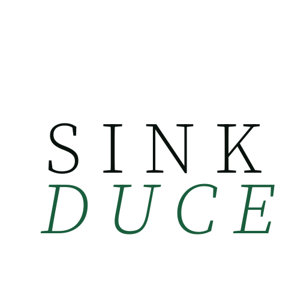

<div align="center">


# SINKDUCE

$$\text{\textbf{Spark. Sink. Educe.}}$$

*智能、按项目隔离的个人记忆：会议、笔记、文件沉入 Collection，可引用的问答，并给外部 Agent 提供 MCP。*

[](LICENSE)
[](https://www.python.org/)
[](https://react.dev/)
[](https://www.docker.com/)
[](https://modelcontextprotocol.io/)

[快速启动](#快速启动) · [工作原理](#工作原理) · [功能](#功能) · [MCP](#mcp) · [技术栈](#技术栈)

</div>

SinkDuce 是一套可自托管的 **RAG 知识系统**，用于个人与项目记忆。支持 macOS 桌面应用或 Docker 部署。会议、笔记与文档按 **Collection** 隔离存储；问答结果附带来源，可回溯至原文。同一资料库同时作为 **MCP 服务** 对外提供，供 Cursor 等编辑器检索与写入。

LLM、Embedding 与语音转写既可使用云端 API，也可接入 **本地模型**（Ollama、LM Studio、vLLM，以及本机 ONNX 语音），需要时即可把推理留在本机。

**Spark** 采集 → **Sink** 沉淀 → **Educe** 调用。

**v1.2.0：** macOS 桌面（Apple Silicon DMG）与 Docker 镜像同一 GitHub Release；**说话人匹配** — 人入库一次，之后的会议会建议同一名字。

---

## 快速启动

### macOS（Apple Silicon）

1. 在 [v1.2.0 Release](https://github.com/superdd-coder/sinkduce/releases/tag/v1.2.0) 下载 **[SinkDuce-macos-arm64-v1.2.0.dmg](https://github.com/superdd-coder/sinkduce/releases/download/v1.2.0/SinkDuce-macos-arm64-v1.2.0.dmg)**。
2. 打开磁盘映像，把 **SinkDuce** 拖进 Applications。
3. 首次打开：右键 → **打开**（ad-hoc 签名，Gatekeeper 可能提示）。
4. 升级后请 **Cmd+Q 再开**——点红灯只是藏到菜单栏。

数据在 `~/Library/Application Support/SinkDuce`。API 和 MCP 默认 `127.0.0.1:18910`（被占用则顺延）。

然后：Settings → 添加 **LLM** 和 **Embedding**（或用下面的 OneShot）→ 建 Collection。

### Docker

```bash
git clone https://github.com/superdd-coder/sinkduce.git
cd sinkduce
docker compose pull && docker compose up -d
```

打开 [http://localhost:18900](http://localhost:18900)。从源码构建：`docker compose -f docker-compose.build.yml up -d --build`。其它布局见 [`deploy/README.md`](deploy/README.md)。

```bash
git pull && docker compose pull && docker compose up -d
```

`data/`（库、配置、会议、笔记、模型）在 volume 里，升级默认不丢。

> [!TIP]
> **DashScope / OpenRouter 一键配置** — Settings → LLM Providers。一把 API Key 可配齐 LLM、Embedding、Rerank、Vision、转写。
>
> **离线语音** — Settings → Local Models → Download local models（ONNX 包来自本仓库 GitHub Release）。
>
> **MinerU（可选）** — 在 [mineru.net](https://mineru.net/apiManage/token) 取 Token，按 Collection 开启；失败回退本地解析。

---

## 工作原理

### Spark — 采集

**会议：** 麦克风 + 系统声混录，或上传音频；可暂停、弃录。转写可用**本地 ONNX** 或云端 ASR。得到总览总结，以及按你现有 Collection 拆开的 **Blueprint 章节**；改完再入库。点总结句可跳回转写时间点并播音频。总结支持翻译和导出。

**说话人匹配（v1.2.0）：** 维护一份人物库。会后会建议是谁在说话，不必每次重命名。

**Notes：** 每个 Collection 里的 Tiptap 编辑器（自动保存）。分屏编辑，蒸馏成引用、源变更后传播、一键入库。可以和会议总结并排打开。

**文件：** PDF、Office、Markdown、HTML、CSV、图片等（含 OCR）。复杂版式可用 MinerU。Library 支持整夹上传。

### Sink — 沉淀

一切落入 **Collection**，按项目或主题隔离。

**Library** 是对应资料的工作界面：

- **文件夹** — 浏览、版本、归档、多选、文件预览。
- **时间线** — 用链和节点看工作怎么演进；可挂文件、消息、待办。

重要来源标 **Definitive**，参与集合总览和**冲突**对照。切分感知句子和 Markdown 标题；可选父子块和上下文增强。

### Educe — 调用

**Chat：** 勾选一个或多个 Collection，本轮可换模型；流式回答，思考 / 检索步骤可见。来源可从片段点到文档再到原文件。复杂问题走 Agentic，简单问题走直接检索。可选**联网搜索**，检索前会先问你。

Library / 会议旁有 **Quick Chat**。要评测召回用 **Recall**。同一套记忆通过 **MCP** 对外，不锁在网页里。

---

## 功能

| 领域 | 你能做什么 |
|------|------------|
| **会议** | 混录或上传 → 转写（本地或云）→ 总结 + 按主题拆章 → 入库。句级回跳、说话人、热词、语言提示、翻译 / 导出。**跨会议说话人匹配**。 |
| **Notes** | 所见即所得编辑（Markdown、表格、图片、任务）。蒸馏、传播引用、入库（图片做 OCR 和视觉描述）。 |
| **Library** | 文件夹、版本、时间线（链 / 节点）、消息、智能待办。Definitive、集合总览、冲突对照。 |
| **入库** | 常见办公 / 网页格式 + OCR；可选 MinerU。图片会生成检索用描述。 |
| **Chat** | 跨库提问、可见步骤、三层来源、对话内换模型。可选、需确认的联网搜索。Quick Chat + Recall。 |
| **配置** | DashScope / OpenRouter 一键配置。Chat / Vision / 会议总结可分模型。Settings 内下载本地 ONNX 语音。 |
| **MCP** | 同一进程 56 个工具 — 库、文件、检索、会议、笔记、热词、任务。 |

---

## MCP

56 个工具，和 API 同一进程、走 HTTP。先启动 SinkDuce，再让客户端连上来。

```json
{
  "mcpServers": {
    "sinkduce": {
      "type": "http",
      "url": "http://127.0.0.1:18900/mcp"
    }
  }
}
```

| | 地址 |
|---|------|
| Docker | `http://127.0.0.1:18900/mcp` |
| 桌面 | 应用实际绑定的端口，一般是 `http://127.0.0.1:18910/mcp` |

| 域 | 工具数 | 用途 |
|----|------:|------|
| Collections | 5 | 列表、创建、配置、删除 |
| Documents | 6 | 列表、上传、全文、分块、definitive |
| File management | 13 | 库树、时间线、文件夹 / 文件 / 版本、上传 |
| Search | 3 | 直接检索、Agentic 检索、历史 |
| Tasks | 5 | 列表、状态、取消、重试 |
| Summaries | 4 | 总览、文档摘要、冲突、固化 |
| Notes | 6 | CRUD + 传播 |
| Meetings | 9 | CRUD、转写、总结、音频 |
| Hot words | 5 | 热词库 |

---

## 技术栈

| | |
|---|---|
| 应用 | Python 3.11、FastAPI、React 19、Vite、Tailwind、Zustand、Tiptap |
| 检索 | Qdrant（稠密 + BM25 混合）、OpenAI 兼容的 LLM / Embedding / Rerank（Cohere、DashScope 等） |
| 解析与语音 | pdfplumber、Office 解析、RapidOCR；可选 MinerU；本地 FunASR ONNX 或云端 ASR |
| 发布 | Docker Hub `jethrohou/sinkduce`（`linux/amd64` + `linux/arm64`）；macOS 桌面是同一套应用套在 Tauri 里 |

---

SinkDuce 采用 **[AGPL-3.0-or-later](LICENSE)**。第三方声明见 [THIRD_PARTY_NOTICES.md](THIRD_PARTY_NOTICES.md)。

[English](README.md)
